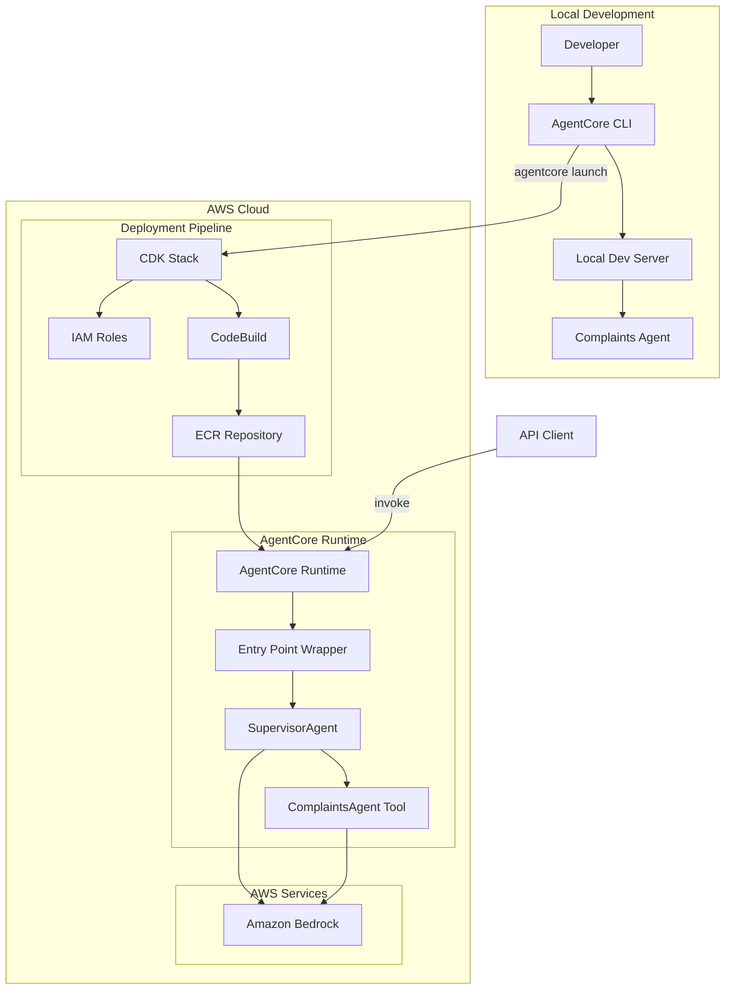
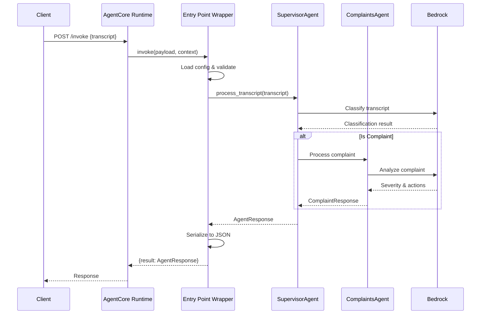

# Design Document: AgentCore Deployment

## Overview

This design describes the containerization and deployment of an existing Strands-based complaints agent to AWS using Amazon Bedrock AgentCore as the runtime. The solution wraps the existing agent with BedrockAgentCoreApp, packages it for deployment, and provisions infrastructure using AWS CDK in Python.

The deployment follows the "direct_code_deploy" pattern where AWS CodeBuild handles container builds automatically in the cloud, eliminating the need for local Docker installation while still providing a Dockerfile for optional local development and testing.

## Architecture



### Component Flow



## Components and Interfaces

### 1. Entry Point Wrapper (`agent.py`)

The AgentCore-compatible entry point that wraps the existing complaints agent.

```python
from bedrock_agentcore import BedrockAgentCoreApp
from pathlib import Path
from complaints_agent.config import ConfigurationLoader
from complaints_agent.agents import SupervisorAgent
from complaints_agent.models import AgentResponse

app = BedrockAgentCoreApp()

def load_config():
    config_path = Path(__file__).parent / "config" / "complaint_criteria.json"
    return ConfigurationLoader.load_criteria(str(config_path))

@app.entrypoint
def invoke(payload: dict, context: dict) -> dict:
    transcript = payload.get("transcript")
    if not transcript:
        return {
            "status": "error",
            "error_message": "Missing required field: transcript"
        }
    
    criteria = load_config()
    supervisor = SupervisorAgent(criteria)
    response = supervisor.process_transcript(transcript)
    
    return {"result": response.to_json()}

if __name__ == "__main__":
    app.run()
```

**Interface:**
- Input: `payload` dict with `transcript` field, `context` dict with runtime metadata
- Output: dict with `result` containing serialized AgentResponse or `status`/`error_message` for errors

### 2. CDK Infrastructure Stack (`infra/stacks/agentcore_stack.py`)

Defines the AWS infrastructure for AgentCore deployment.

```python
from aws_cdk import (
    Stack,
    aws_iam as iam,
    CfnOutput,
    Tags,
)
from constructs import Construct

class AgentCoreDeploymentStack(Stack):
    def __init__(
        self,
        scope: Construct,
        construct_id: str,
        environment: str,
        bedrock_model_ids: list[str],
        **kwargs
    ) -> None:
        super().__init__(scope, construct_id, **kwargs)
        
        self.execution_role = self._create_execution_role(bedrock_model_ids)
        self._add_outputs()
        self._apply_tags(environment)
    
    def _create_execution_role(self, model_ids: list[str]) -> iam.Role:
        pass
    
    def _add_outputs(self) -> None:
        pass
    
    def _apply_tags(self, environment: str) -> None:
        pass
```

**Interface:**
- Input: `environment` (dev/staging/prod), `bedrock_model_ids` list
- Output: IAM execution role ARN via CloudFormation outputs

### 3. IAM Execution Role

Least-privilege IAM role for the AgentCore runtime.

```python
execution_role = iam.Role(
    self,
    "AgentCoreExecutionRole",
    assumed_by=iam.ServicePrincipal("agentcore.bedrock.amazonaws.com"),
    description="Execution role for Complaints Agent in AgentCore",
)

bedrock_policy = iam.PolicyStatement(
    effect=iam.Effect.ALLOW,
    actions=["bedrock:InvokeModel"],
    resources=[
        f"arn:aws:bedrock:{self.region}::foundation-model/{model_id}"
        for model_id in bedrock_model_ids
    ],
)
execution_role.add_to_policy(bedrock_policy)
```

### 4. Dockerfile

Container configuration for optional local development and container deployment mode.

```dockerfile
FROM public.ecr.aws/lambda/python:3.12

WORKDIR /app

COPY requirements.txt .
RUN pip install --no-cache-dir -r requirements.txt

COPY src/ ./src/
COPY config/ ./config/
COPY agent.py .

ENV PYTHONPATH=/app/src

CMD ["python", "agent.py"]
```

### 5. Deployment Scripts (`scripts/`)

Shell scripts for common deployment operations.

**deploy.sh:**
```bash
#!/bin/bash
set -e

ENVIRONMENT=${1:-dev}

python3 -m pip install -r requirements.txt
python3 -m pip install bedrock-agentcore-starter-toolkit

agentcore configure --entrypoint agent.py --non-interactive
agentcore launch
```

**local-dev.sh:**
```bash
#!/bin/bash
agentcore dev --entrypoint agent.py
```

### 6. Configuration System

Environment-aware configuration loading with fallback to bundled defaults.

```python
import os
from pathlib import Path

def get_config_path() -> Path:
    env_path = os.environ.get("COMPLAINT_CRITERIA_PATH")
    if env_path:
        return Path(env_path)
    return Path(__file__).parent.parent / "config" / "complaint_criteria.json"
```

## Data Models

### Request Contract

```json
{
  "transcript": "string (required) - Customer service transcript text",
  "config_override": {
    "keywords": ["optional", "list"],
    "sentiment_indicators": ["optional", "list"],
    "severity_thresholds": {"optional": "dict"}
  }
}
```

### Response Contract - Success

```json
{
  "result": {
    "is_complaint": true,
    "summary": "Complaint identified: Customer expressed frustration about overdraft fee",
    "complaint": {
      "transcript": "...",
      "classification_result": "complaint",
      "timestamp": "2024-01-15T10:30:00Z",
      "matched_criteria": ["frustrated", "overdraft"]
    },
    "complaint_response": {
      "severity": "high",
      "category": "fee_dispute",
      "actions_taken": ["Logged complaint", "Initiated fee review"],
      "next_steps": ["Follow up within 24 hours"]
    }
  }
}
```

### Response Contract - Error

```json
{
  "status": "error",
  "error_message": "Missing required field: transcript"
}
```

### CDK Stack Configuration

```python
@dataclass
class AgentCoreConfig:
    environment: str
    bedrock_model_ids: list[str]
    agent_name: str
    execution_role_arn: str | None = None
```


## Correctness Properties

*A property is a characteristic or behavior that should hold true across all valid executions of a system—essentially, a formal statement about what the system should do. Properties serve as the bridge between human-readable specifications and machine-verifiable correctness guarantees.*

### Property 1: Response Serialization Round-Trip

*For any* valid AgentResponse object returned by the SupervisorAgent, serializing it to JSON and deserializing it back SHALL produce an equivalent AgentResponse with identical field values.

**Validates: Requirements 1.4, 9.3**

### Property 2: Invalid Input Error Handling

*For any* payload that is missing the required `transcript` field or contains an empty/whitespace-only transcript, the invoke function SHALL return an error response with `status: "error"` and a non-empty `error_message` field.

**Validates: Requirements 1.5, 9.5**

### Property 3: Exception Error Response Structure

*For any* exception that occurs during transcript processing, the invoke function SHALL catch the exception and return a structured error response containing `status: "error"` and `error_message` fields, never propagating the raw exception.

**Validates: Requirements 1.6, 9.4**

### Property 4: IAM Least Privilege Policy

*For any* IAM policy attached to the AgentCore execution role, the policy SHALL only grant `bedrock:InvokeModel` action, and the resource ARNs SHALL be restricted to the specific Bedrock model IDs configured for the agent.

**Validates: Requirements 5.1, 5.2, 5.5**

### Property 5: Environment Parameterization

*For any* two different environment configurations (dev, staging, prod), instantiating the CDK stack with different environment parameters SHALL produce stacks with distinct resource names and appropriate environment-specific tags.

**Validates: Requirements 4.7**

### Property 6: Configuration Override via Environment

*For any* valid file path set in the `COMPLAINT_CRITERIA_PATH` environment variable, the configuration system SHALL load complaint criteria from that path instead of the default bundled config file.

**Validates: Requirements 8.2**

### Property 7: Configuration Validation Fail-Fast

*For any* invalid configuration file (malformed JSON, missing required fields, or non-existent path), the configuration system SHALL raise a ConfigurationError with a descriptive message before agent initialization completes.

**Validates: Requirements 8.3**

### Property 8: Request Contract Validation

*For any* valid JSON payload containing a non-empty `transcript` field, the invoke function SHALL accept the request and return a response with a `result` field. Optional `config_override` fields SHALL be processed when present without causing errors.

**Validates: Requirements 9.1, 9.2**

### Property 9: Local/Production Configuration Consistency

*For any* configuration loaded in local development mode, the loaded ComplaintCriteria object SHALL be equivalent to the configuration that would be loaded in the production AgentCore runtime environment.

**Validates: Requirements 7.4**

## Error Handling

### Entry Point Wrapper Errors

| Error Condition | Response | HTTP Status |
|----------------|----------|-------------|
| Missing transcript field | `{"status": "error", "error_message": "Missing required field: transcript"}` | 400 |
| Empty transcript | `{"status": "error", "error_message": "Transcript cannot be empty"}` | 400 |
| Invalid JSON payload | `{"status": "error", "error_message": "Invalid JSON payload"}` | 400 |
| Configuration load failure | `{"status": "error", "error_message": "Failed to load configuration: {details}"}` | 500 |
| Agent processing error | `{"status": "error", "error_message": "Agent processing failed: {details}"}` | 500 |
| Bedrock invocation error | `{"status": "error", "error_message": "Model invocation failed: {details}"}` | 502 |

### CDK Deployment Errors

| Error Condition | Handling |
|----------------|----------|
| Missing AWS credentials | Fail with clear message about credential configuration |
| Insufficient IAM permissions | Fail with required permissions list |
| Stack already exists | Prompt for update or fail based on configuration |
| Invalid model ID | Fail during synthesis with validation error |

### Configuration Errors

```python
class ConfigurationError(Exception):
    pass

def load_config():
    try:
        path = get_config_path()
        if not path.exists():
            raise ConfigurationError(f"Configuration file not found: {path}")
        return ConfigurationLoader.load_criteria(str(path))
    except json.JSONDecodeError as e:
        raise ConfigurationError(f"Invalid JSON in configuration: {e}")
    except KeyError as e:
        raise ConfigurationError(f"Missing required configuration field: {e}")
```

## Testing Strategy

### Unit Tests

Unit tests verify individual components in isolation with mocked dependencies.

**Entry Point Wrapper Tests:**
- Test invoke function with valid payloads
- Test error handling for missing/invalid fields
- Test configuration loading
- Mock SupervisorAgent to isolate wrapper logic

**Configuration Tests:**
- Test default path resolution
- Test environment variable override
- Test validation of malformed configs
- Test serialization/deserialization round-trip

**CDK Stack Tests:**
- Use CDK assertions for resource verification
- Test IAM policy statements
- Test environment parameterization
- Snapshot testing for stack templates

### Property-Based Tests

Property-based tests verify universal properties across many generated inputs using the `hypothesis` library (already in project dependencies).

**Test Configuration:**
- Minimum 100 iterations per property test
- Use `hypothesis` strategies for input generation
- Tag format: `Feature: agentcore-deployment, Property {N}: {title}`

**Property Test Implementation:**

```python
from hypothesis import given, strategies as st
import pytest

class TestResponseSerialization:
    """Feature: agentcore-deployment, Property 1: Response Serialization Round-Trip"""
    
    @given(
        is_complaint=st.booleans(),
        summary=st.text(min_size=1, max_size=500),
        severity=st.sampled_from(["low", "medium", "high", "critical"]),
        category=st.text(min_size=1, max_size=100),
    )
    def test_agent_response_round_trip(self, is_complaint, summary, severity, category):
        pass

class TestInvalidInputHandling:
    """Feature: agentcore-deployment, Property 2: Invalid Input Error Handling"""
    
    @given(payload=st.dictionaries(
        keys=st.text().filter(lambda x: x != "transcript"),
        values=st.text(),
        max_size=5
    ))
    def test_missing_transcript_returns_error(self, payload):
        pass

class TestIAMPolicy:
    """Feature: agentcore-deployment, Property 4: IAM Least Privilege Policy"""
    
    @given(model_ids=st.lists(
        st.sampled_from([
            "anthropic.claude-3-sonnet-20240229-v1:0",
            "anthropic.claude-3-haiku-20240307-v1:0",
            "us.anthropic.claude-sonnet-4-20250514-v1:0",
        ]),
        min_size=1,
        max_size=3,
        unique=True
    ))
    def test_iam_policy_restricts_to_specified_models(self, model_ids):
        pass
```

### Integration Tests

Integration tests verify the complete flow with real AWS services (run locally against AWS).

**Local AgentCore Tests:**
- Start local dev server with `agentcore dev`
- Send test payloads via `agentcore invoke`
- Verify response structure and content

**CDK Deployment Tests:**
- Synthesize stack and verify CloudFormation template
- Deploy to test environment
- Invoke deployed agent and verify responses
- Clean up with `agentcore destroy`

### Test Organization

```
tests/
├── unit/
│   ├── test_entry_point.py
│   ├── test_config_loader.py
│   └── test_cdk_stack.py
├── property/
│   ├── test_response_serialization.py
│   ├── test_input_validation.py
│   ├── test_iam_policy.py
│   └── test_config_override.py
└── integration/
    ├── test_local_dev.py
    └── test_deployment.py
```
