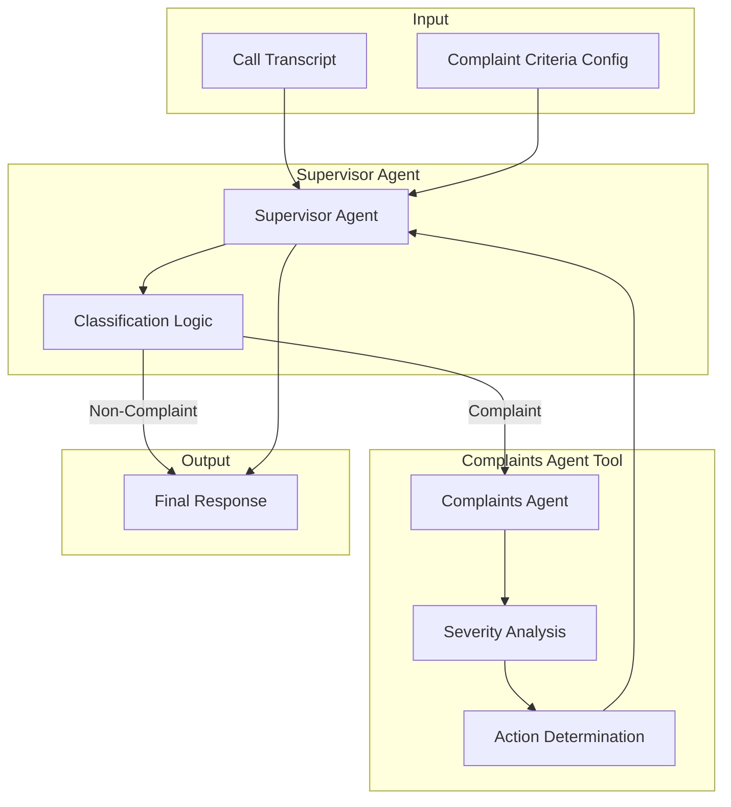
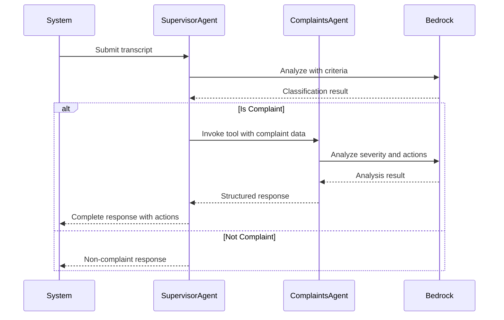

# Design Document: Complaints Agentic Solution

## Overview

This design describes a multi-agent complaints processing system built with AWS Strands Agents SDK and Amazon Bedrock. The system uses the "Agents as Tools" pattern where a Supervisor Agent classifies customer call transcripts and delegates complaint processing to a specialized Complaints Agent wrapped as a tool.

The architecture follows a hierarchical delegation model:
1. Supervisor Agent receives transcripts and classifies them using business defined criteria
2. When a complaint is identified, the Supervisor Agent invokes the Complaints Agent tool
3. Complaints Agent analyzes severity, determines actions, and returns structured response
4. Supervisor Agent captures the response and produces final output

## Architecture



### Component Interaction Flow



## Components and Interfaces

### 1. Supervisor Agent

The primary agent that receives transcripts and orchestrates the complaint flow.

```python
class SupervisorAgent:
    """
    Primary agent for transcript classification and complaint routing.
    Uses Strands Agent with Complaints Agent as a tool.
    """
    
    def __init__(self, criteria_config: ComplaintCriteria):
        """
        Initialize with complaint criteria configuration.
        
        Args:
            criteria_config: Business defined complaint criteria
        """
        pass
    
    def process_transcript(self, transcript: str) -> AgentResponse:
        """
        Process a call transcript and return classification result.
        
        Args:
            transcript: The call transcript text
            
        Returns:
            AgentResponse with classification and any complaint processing results
        """
        pass
```

### 2. Complaints Agent Tool

Specialized agent wrapped as a Strands tool for complaint processing.

```python
@tool
def complaints_agent(complaint_data: str) -> str:
    """
    Process a classified complaint and determine appropriate actions.
    
    Args:
        complaint_data: JSON string containing transcript and classification details
        
    Returns:
        JSON string containing severity, category, actions taken, and next steps
    """
    pass
```

### 3. Configuration Loader

Handles loading and validation of complaint criteria.

```python
class ConfigurationLoader:
    """Loads complaint criteria from configuration sources."""
    
    @staticmethod
    def load_criteria(config_path: str) -> ComplaintCriteria:
        """
        Load complaint criteria from JSON configuration file.
        
        Args:
            config_path: Path to the configuration file
            
        Returns:
            ComplaintCriteria object
        """
        pass
    
    @staticmethod
    def serialize_criteria(criteria: ComplaintCriteria) -> str:
        """
        Serialize complaint criteria to JSON string.
        
        Args:
            criteria: ComplaintCriteria object
            
        Returns:
            JSON string representation
        """
        pass
    
    @staticmethod
    def deserialize_criteria(json_str: str) -> ComplaintCriteria:
        """
        Deserialize JSON string to ComplaintCriteria object.
        
        Args:
            json_str: JSON string representation
            
        Returns:
            ComplaintCriteria object
        """
        pass
```

## Data Models

### ComplaintCriteria

```python
from dataclasses import dataclass
from typing import List

@dataclass
class ComplaintCriteria:
    """Business defined criteria for complaint classification."""
    keywords: List[str]  # Keywords indicating complaints
    sentiment_indicators: List[str]  # Negative sentiment phrases
    severity_thresholds: dict  # Thresholds for severity levels
    
    def to_json(self) -> str:
        """Serialize to JSON string."""
        pass
    
    @classmethod
    def from_json(cls, json_str: str) -> 'ComplaintCriteria':
        """Deserialize from JSON string."""
        pass
```

### Complaint

```python
from dataclasses import dataclass
from datetime import datetime

@dataclass
class Complaint:
    """Represents a classified complaint."""
    transcript: str
    classification_result: str  # "complaint" or "non_complaint"
    timestamp: datetime
    matched_criteria: List[str]  # Which criteria matched
    
    def to_json(self) -> str:
        """Serialize to JSON string."""
        pass
    
    @classmethod
    def from_json(cls, json_str: str) -> 'Complaint':
        """Deserialize from JSON string."""
        pass
```

### ComplaintResponse

```python
from dataclasses import dataclass
from typing import List

@dataclass
class ComplaintResponse:
    """Response from the Complaints Agent."""
    severity: str  # "low", "medium", "high", "critical"
    category: str  # Type of complaint
    actions_taken: List[str]  # Actions performed
    next_steps: List[str]  # Recommended follow-up actions
    
    def to_json(self) -> str:
        """Serialize to JSON string."""
        pass
    
    @classmethod
    def from_json(cls, json_str: str) -> 'ComplaintResponse':
        """Deserialize from JSON string."""
        pass
```

### AgentResponse

```python
from dataclasses import dataclass
from typing import Optional

@dataclass
class AgentResponse:
    """Final response from the Supervisor Agent."""
    is_complaint: bool
    complaint: Optional[Complaint]
    complaint_response: Optional[ComplaintResponse]
    summary: str
    
    def to_json(self) -> str:
        """Serialize to JSON string."""
        pass
    
    @classmethod
    def from_json(cls, json_str: str) -> 'AgentResponse':
        """Deserialize from JSON string."""
        pass
```

## Correctness Properties

*A property is a characteristic or behavior that should hold true across all valid executions of a system, essentially, a formal statement about what the system should do. Properties serve as the bridge between human readable specifications and machine verifiable correctness guarantees.*

### Property 1: Classification produces result for any transcript

*For any* transcript string and valid complaint criteria, the Supervisor Agent SHALL produce a classification result that is either "complaint" or "non_complaint".

**Validates: Requirements 1.1**

### Property 2: Complaint indicators lead to complaint classification

*For any* transcript containing at least one keyword from the complaint criteria keywords list, the Supervisor Agent SHALL classify the interaction as a complaint.

**Validates: Requirements 1.2, 2.2**

### Property 3: Clean transcripts lead to non-complaint classification

*For any* transcript that contains no keywords from the complaint criteria and no negative sentiment indicators, the Supervisor Agent SHALL classify the interaction as a non-complaint.

**Validates: Requirements 1.3**

### Property 4: Complaint criteria round trip

*For any* valid ComplaintCriteria object, serializing to JSON and then deserializing SHALL produce an equivalent ComplaintCriteria object.

**Validates: Requirements 2.4, 2.5**

### Property 5: Complaints Agent produces complete structured response

*For any* valid complaint input, the Complaints Agent SHALL return a ComplaintResponse containing non-empty severity, category, actions_taken, and next_steps fields.

**Validates: Requirements 3.1, 3.2, 3.3**

### Property 6: Error inputs produce error responses

*For any* invalid or malformed complaint input, the Complaints Agent SHALL return a response indicating an error with descriptive details.

**Validates: Requirements 3.4**

### Property 7: Supervisor Agent captures complete Complaints Agent response

*For any* complaint that is processed by the Complaints Agent, the Supervisor Agent final output SHALL contain the complete actions_taken and next_steps from the Complaints Agent response.

**Validates: Requirements 4.1, 4.2, 4.3**

### Property 8: Non-complaint returns appropriate response

*For any* transcript classified as non-complaint, the Supervisor Agent SHALL return an AgentResponse with is_complaint=False and complaint_response=None.

**Validates: Requirements 4.4**

### Property 9: Complaint object contains required fields

*For any* Complaint object created by the system, the object SHALL contain non-null transcript, classification_result, and timestamp fields.

**Validates: Requirements 6.1**

### Property 10: Complaint response contains required fields

*For any* ComplaintResponse object created by the Complaints Agent, the object SHALL contain non-null severity, category, actions_taken, and next_steps fields.

**Validates: Requirements 6.2**

### Property 11: Complaint data round trip

*For any* valid Complaint object, serializing to JSON and then deserializing SHALL produce an equivalent Complaint object.

**Validates: Requirements 6.4, 6.5**

### Property 12: ComplaintResponse data round trip

*For any* valid ComplaintResponse object, serializing to JSON and then deserializing SHALL produce an equivalent ComplaintResponse object.

**Validates: Requirements 6.4, 6.5**

## Error Handling

### Classification Errors

- Invalid transcript (empty or null): Return error response without invoking Complaints Agent
- Criteria loading failure: Raise configuration error with details
- Model timeout: Retry with exponential backoff, max 3 attempts

### Complaints Agent Errors

- Invalid complaint data format: Return error response with parsing details
- Model failure: Return error response indicating processing failure
- Timeout: Return partial response if available, otherwise error

### Data Serialization Errors

- JSON encoding failure: Raise serialization error with field details
- JSON decoding failure: Raise deserialization error with parse location
- Missing required fields: Raise validation error listing missing fields

## Testing Strategy

### Property Based Testing

The system uses **Hypothesis** as the property based testing library for Python. Each correctness property is implemented as a property based test that verifies the property holds across many randomly generated inputs.

Configuration:
- Minimum 100 iterations per property test
- Each test is tagged with the property it implements using the format: `**Feature: complaints-agent, Property {number}: {property_text}**`

### Unit Testing

Unit tests cover:
- Specific examples demonstrating correct classification behavior
- Edge cases for empty transcripts, single word transcripts
- Integration between Supervisor Agent and Complaints Agent tool
- Configuration loading from file

### Test Organization

```
tests/
    test_models.py           # Data model unit tests and property tests
    test_classification.py   # Classification logic property tests
    test_complaints_agent.py # Complaints Agent property tests
    test_integration.py      # End to end integration tests
```
