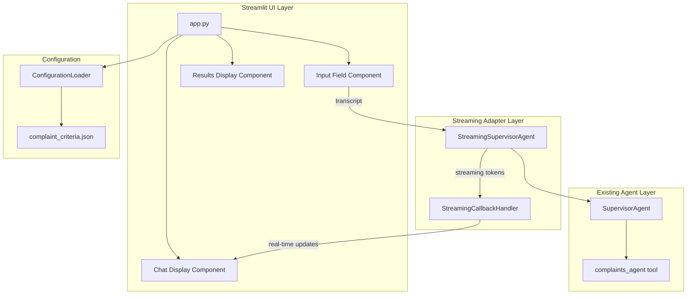

# Design Document: Streamlit Web Interface

## Overview

This design describes a Streamlit-based web interface for the complaints agent system. The interface provides a chat-like experience where users can submit customer call transcripts for analysis. The system integrates with the existing SupervisorAgent to classify transcripts and route complaints to the ComplaintsAgent for processing. A key feature is real-time streaming of agent responses using Strands Agent callback handlers, providing immediate feedback to users during processing.

## Architecture

The application follows a layered architecture with clear separation between the UI layer (Streamlit), the streaming adapter layer, and the existing agent layer.



## Components and Interfaces

### StreamingCallbackHandler

A custom callback handler that captures streaming tokens and makes them available to the Streamlit UI.

```python
from typing import Any, Callable

class StreamingCallbackHandler:
    """Callback handler that captures streaming tokens for Streamlit display."""
    
    def __init__(self, on_token: Callable[[str], None]):
        """Initialize with a callback function for token updates.
        
        Args:
            on_token: Function called with each new token
        """
        self.on_token = on_token
        self.tool_count = 0
        self.previous_tool_use = None
    
    def __call__(self, **kwargs: Any) -> None:
        """Process streaming events from the agent.
        
        Args:
            **kwargs: Event data including:
                - data (str): Text content to stream
                - complete (bool): Whether this is the final chunk
                - current_tool_use (dict): Information about tool being used
        """
        pass
```

### StreamingSupervisorAgent

A wrapper around the existing SupervisorAgent that enables streaming responses.

```python
from typing import Generator
from complaints_agent.models import AgentResponse
from complaints_agent.models import ComplaintCriteria

class StreamingSupervisorAgent:
    """Wrapper for SupervisorAgent that provides streaming capabilities."""
    
    def __init__(self, criteria_config: ComplaintCriteria):
        """Initialize with complaint criteria configuration.
        
        Args:
            criteria_config: Business defined complaint criteria
        """
        pass
    
    def process_transcript_streaming(
        self, 
        transcript: str,
        on_token: Callable[[str], None]
    ) -> AgentResponse:
        """Process a transcript with streaming token output.
        
        Args:
            transcript: The call transcript text
            on_token: Callback function for each token
            
        Returns:
            AgentResponse with classification and complaint processing results
        """
        pass
```

### ChatMessage

A data class representing a message in the chat history.

```python
from dataclasses import dataclass
from typing import Optional
from datetime import datetime
from complaints_agent.models import AgentResponse

@dataclass
class ChatMessage:
    """Represents a message in the chat history."""
    
    role: str  # "user" or "assistant"
    content: str
    timestamp: datetime
    agent_response: Optional[AgentResponse] = None
```

### Streamlit App Functions

```python
def initialize_session_state() -> None:
    """Initialize Streamlit session state with default values."""
    pass

def display_chat_history() -> None:
    """Render all messages from session state chat history."""
    pass

def display_agent_response(response: AgentResponse) -> None:
    """Display structured agent response with complaint details.
    
    Args:
        response: The AgentResponse from the supervisor agent
    """
    pass

def display_complaint_details(response: AgentResponse) -> None:
    """Display complaint details in an expandable section.
    
    Args:
        response: The AgentResponse containing complaint information
    """
    pass

def handle_user_input(transcript: str) -> None:
    """Process user input and invoke the streaming agent.
    
    Args:
        transcript: The user's input transcript
    """
    pass

def clear_chat_history() -> None:
    """Clear all messages from session state."""
    pass
```

## Data Models

The application uses the existing data models from the complaints_agent package:

### Existing Models (from complaints_agent.models)

- **Complaint**: Contains transcript, classification_result, timestamp, matched_criteria
- **ComplaintResponse**: Contains severity, category, actions_taken, next_steps
- **AgentResponse**: Contains is_complaint, summary, complaint, complaint_response
- **ComplaintCriteria**: Contains keywords, sentiment_indicators, severity_thresholds

### New Model

```python
@dataclass
class ChatMessage:
    """Represents a message in the chat history.
    
    Attributes:
        role: Either "user" or "assistant"
        content: The text content of the message
        timestamp: When the message was created
        agent_response: Optional structured response for assistant messages
    """
    role: str
    content: str
    timestamp: datetime
    agent_response: Optional[AgentResponse] = None
```

### Session State Structure

```python
session_state = {
    "messages": List[ChatMessage],  # Chat history
    "agent": StreamingSupervisorAgent,  # Cached agent instance
    "criteria": ComplaintCriteria,  # Loaded complaint criteria
}
```

## Correctness Properties

*A property is a characteristic or behavior that should hold true across all valid executions of a system—essentially, a formal statement about what the system should do. Properties serve as the bridge between human-readable specifications and machine-verifiable correctness guarantees.*


Based on the prework analysis, the following properties have been identified and consolidated to eliminate redundancy:

### Property 1: Message Chronological Ordering

*For any* list of ChatMessage objects in session state, when displayed in the chat interface, the messages SHALL appear in chronological order based on their timestamp field.

**Validates: Requirements 1.3**

### Property 2: Non-Empty Transcript Adds Message

*For any* non-empty, non-whitespace transcript string submitted by a user, the session state messages list length SHALL increase by exactly one, and the new message SHALL have role "user" and content equal to the submitted transcript.

**Validates: Requirements 2.2**

### Property 3: Whitespace Input Rejection

*For any* string composed entirely of whitespace characters (including empty string), submitting it SHALL NOT change the session state messages list length.

**Validates: Requirements 2.3**

### Property 4: Streaming Callback Token Delivery

*For any* valid transcript processed by the StreamingSupervisorAgent, the on_token callback function SHALL be invoked at least once with non-empty string data before the processing completes.

**Validates: Requirements 3.1**

### Property 5: Complaint Response Completeness

*For any* AgentResponse where is_complaint is True, the complaint_response field SHALL be non-None and SHALL contain: a non-empty severity string, a non-empty category string, a non-empty actions_taken list, and a non-empty next_steps list. Additionally, the complaint field SHALL contain a non-empty matched_criteria list.

**Validates: Requirements 3.3, 5.1, 5.2, 6.1, 6.2, 6.3, 6.4**

### Property 6: Session State Persistence Round-Trip

*For any* list of ChatMessage objects stored in session state, after a simulated page rerun, retrieving the messages from session state SHALL return an equivalent list with the same length and identical message contents.

**Validates: Requirements 7.1, 7.2**

## Error Handling

### Agent Initialization Errors

When the ConfigurationLoader fails to load complaint criteria (file not found, invalid JSON, missing required fields), the application SHALL:
1. Display a user-friendly error message using `st.error()`
2. Disable the input field to prevent submission
3. Log the detailed error for debugging

### Agent Processing Errors

When the SupervisorAgent encounters an error during transcript processing, the application SHALL:
1. Catch the exception in the `handle_user_input` function
2. Display an error message to the user using `st.error()`
3. NOT add a partial or failed response to the chat history
4. Allow the user to retry with the same or different input

### Streaming Errors

If streaming is interrupted or fails mid-stream, the application SHALL:
1. Display any partial content received before the error
2. Show an error indicator that processing was incomplete
3. Store the partial response with an error flag in the chat history

### Input Validation

Empty or whitespace-only inputs are handled at the UI level:
1. The submit button is disabled when input is empty
2. Whitespace-only inputs are trimmed and rejected before agent invocation

## Testing Strategy

### Unit Tests

Unit tests focus on specific examples and edge cases:

1. **Session State Initialization**: Verify default values are set correctly
2. **ChatMessage Creation**: Test dataclass instantiation with various inputs
3. **Clear History Function**: Verify history is emptied correctly
4. **Error Display**: Test error message rendering for various error types
5. **Configuration Loading**: Test loading from valid and invalid config files

### Property-Based Tests

Property-based tests use the `hypothesis` library (already in requirements.txt) to verify universal properties:

1. **Message Ordering Property**: Generate random lists of ChatMessages with various timestamps, verify display order matches chronological order
2. **Input Validation Property**: Generate random whitespace strings, verify none are accepted
3. **Non-Empty Input Property**: Generate random non-whitespace strings, verify all are accepted and added to history
4. **Complaint Completeness Property**: Generate mock AgentResponses with is_complaint=True, verify all required fields are present
5. **Session Persistence Property**: Generate random message lists, simulate persistence round-trip, verify equality

### Test Configuration

- Property tests run with minimum 100 iterations
- Each property test is tagged with: **Feature: streamlit-web-interface, Property {number}: {property_text}**
- Tests use pytest with hypothesis integration
- Mock the Strands Agent to avoid external API calls during testing

### Integration Tests

Integration tests verify the complete flow:

1. **End-to-End Complaint Flow**: Submit a complaint transcript, verify streaming occurs, verify complaint details are displayed
2. **End-to-End Non-Complaint Flow**: Submit a non-complaint transcript, verify classification is displayed
3. **Error Recovery**: Simulate agent errors, verify error handling and recovery
